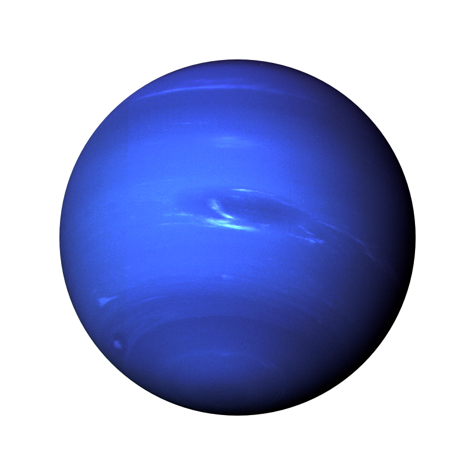

# 🍟 GBPS
*GBPS - аналог GBPS в Gorebox, виде мода.
мод является форком MPMod от Параллелипипеда*

# 🦇 Как установить?
*Нажмите на "+", затем "download ZIP", потом распакуйте архив и закиньте в папку по этому пути:*
``Телефон/Android/data/com.F2Games.GBDE/files/Mods/``

***Готово!***

# 🫪 Как работает мод?
*При запуске будет 2 кнопки "Я", где можно выбрать цвет ника и GBPS, и там ав можете выбрать будет ли включены моды, коды и прочее. 
Чтобы создать сервер "Нажмите на кнопку "Создать/Подключиться на сервер", так же слево вы можете выбрать карту, а справа регион. (Так вы можете генировать название коды.)*

# 🔘 Минусы
*- Мод скорее всего не работает на 16.4.*

*- Не полностью перевёд на русский язык и могут быть ошибки с переводом.*

- ***ТУПОЙ*** *баг с удалением вас в рандомный момент с тул гана.*

# 🫥 Как мод работает?
*Оригинал запускается на серверах локально, но у форка на своих серверах фотона, для тех у кого не работает MPMod можете попробовать этот.*

